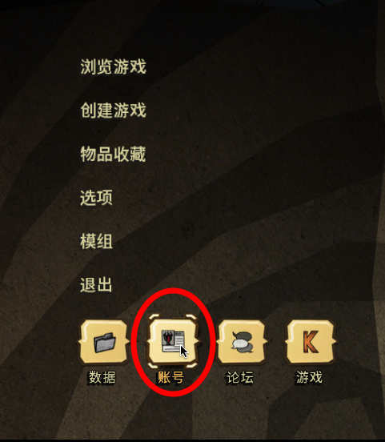
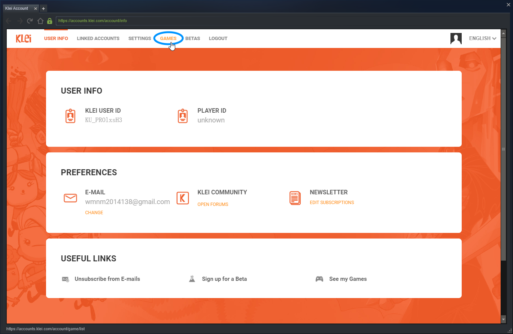
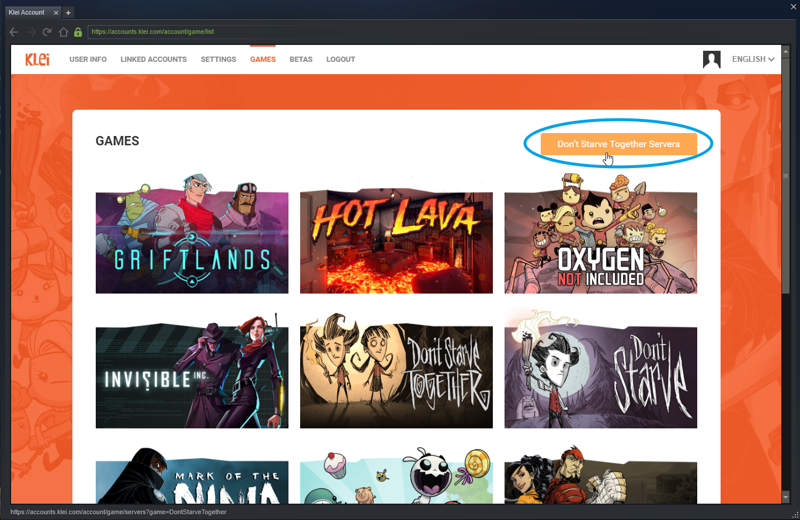
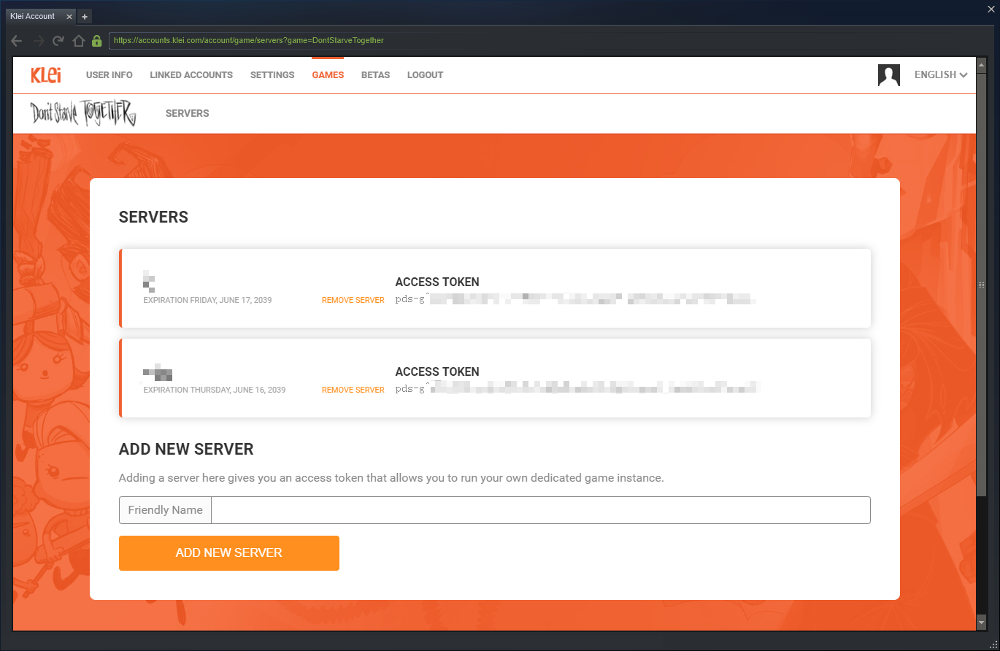

# 配置饥荒联机版（DST）的专用服务器（Linux 版)

> 参考的文档
> 
> [V 社的 SteamCMD 文档](https://developer.valvesoftware.com/wiki/SteamCMD:zh-cn)
> 
> http://blog.ttionya.com/article-1233.html
> 
> http://blog.ttionya.com/article-1235.html
> 
> [Klei 论坛的教程](https://forums.kleientertainment.com/forums/topic/64441-dedicated-server-quick-setup-guide-linux/)

配置过程总的来说，就是在 Linux 上安装 SteamCMD，通过 SteamCMD 安装饥荒专用服务器，并写好（放入）配置文件。文件的结构可以参考本地存档。

这里的操作都基于 Debian 及其发行版 (Ubuntu)。

## 处理依赖库

首先处理依赖库以保证安装的顺利。如果你碰到了什么问题，多半是运行库的锅。注意 Steam 需要的所有库***都是 i386*** 而不是 *amd64* 版的。

按照[Klei 的教程](https://forums.kleientertainment.com/forums/topic/64441-dedicated-server-quick-setup-guide-linux/)，需要的库有libstdc++6，libgcc1，libcurl4-gnutls-dev

```
# For a 64-bit machine:
sudo apt-get install libstdc++6:i386 libgcc1:i386 libcurl4-gnutls-dev:i386
 
# For a 32-bit machine:
sudo apt-get install libstdc++6 libgcc1 libcurl4-gnutls-dev
```
实测libgcc1可以安装 amd64 版。

## 安装 SteamCMD

> [用户操作参考](https://www.runoob.com/linux/linux-user-manage.html)
> 
> sudo 权限参考：
> https://www.digitalocean.com/community/tutorials/initial-server-setup-with-ubuntu-16-04
> https://www.digitalocean.com/community/tutorials/how-to-edit-the-sudoers-file-on-ubuntu-and-centos
> 
> **必须用 visudo** (实际上可能启动的是 nano 而不是 vi)

首先以root登录。添加一个用户 steamuser，并授予 sudo 权限

```
useradd -m steamuser && usermod -aG sudo username
passwd steamuser
```
（删掉用户重来用`userdel -fr 用户名`）

还是以 root 身份进行下列操作
1. 进入 steamuser 的主目录，新建一个 Steam 目录用来解压 SteamCMD 的安装包（SteamCMD 安装完会生成一个 Steam 文件夹，所以不如干脆使用 Steam 解压安装包）
2. 下载安装包并解压
3. 切换到 steamuser（注意**涉及到运行脚本均以 steamuser 身份运行**）
4. 运行 steamcmd 脚本 + 以匿名账户登录 SteamCMD + 设定安装目录为 /home/steamuser/**dst** + 安装饥荒专用服务器并校验文件（只需要在第一次下载时校验）+ 退出

```
mkdir /home/steamuser/Steam && cd /home/steamuser/Steam

curl -sqL "https://steamcdn-a.akamaihd.net/client/installer/steamcmd_linux.tar.gz" | tar zxvf -

su - steamuser

./steamcmd.sh +login anonymous +force_install_dir /home/steamuser/dst +app_update 343050 validate +quit
```

## 写一个启动脚本
```
cd /home/steamuser/dst/bin
ldd dontstarve_dedicated_server_nullrenderer
./dontstarve_dedicated_server_nullrenderer
```

> 如果没有报错说明依赖处理好了，启动脚本需要依赖这个`dontstarve_dedicated_server_nullrenderer`，如果有其他报错，参考[这里](http://blog.ttionya.com/article-1233.html)，或搜索该库文件属于哪个包（e.g. [curl-gnutls.so.4 属于哪个包？](https://stackoverflow.com/questions/37012612/how-to-create-lib-curl-gnutls-so-4#comment67924043_39318677)）

写入启动脚本，这里不管洞穴只写主世界，保存为 start.sh（名字随意，如果保存不了加 sudo）

```
echo ./dontstarve_dedicated_server_nullrenderer -console -cluster MyDediServer -shard Master > start.sh
sh start.sh
```

脚本会开始运行，待出现 Your Server Will Not Start 字样后，按 Ctrl+C 终止脚本进程。此时运行了一遍没有配置文件的服务器，在 /home/steamuser/ 下有文件夹 .klei 。主要目录结构和本地存档大致相同，如下所示（tree -d 命令）。如果运行了洞穴的启动脚本还会有括号里的 Cave 目录。

```
.klei
 ├── Agreements
 │   └── DoNotStarveTogether
 └── DoNotStarveTogether
     ├── MyDediServer
     │   ├── Master
     │   │   ├── backup
     │   │   └── save
     │   └── (Cave)
     └── Cluster_1 …
```

然后退出 steamuser，再删除多余的 Cluster 目录

```
exit
rm -rf ~/.klei/DoNotStarveTogether/Cluster_*
```

## 配置文件
需要的配置文件有
- cluster.ini (服务器存档配置，定义服务器名字、密码、pvp 等，可以在本地存档里找到）
- cluster_token.txt (自己的 token，下文讲如何获取）
- server.ini (服务器配置，一般不改)
- worldgenoverride.lua (世界配置，定义时间、季节、生物等，可以在本地存档里找到)
- dedicated_server_mods_setup.lua (需要下载哪些 mod，id 可以在 modoverrides.lua 里找)
- modoverrides.lua (mod 的配置，可以在本地存档里找到)
[详细配置参考](http://blog.ttionya.com/article-1235.html)

```
/home/steamuser/.klei/DoNotStarveTogether/MyDediServer
├── cluster.ini
├── cluster_token.txt
├── (adminlist.txt)
├── (blocklist.txt)
├── (whitelist.txt)
│
└── **Master**
    ├── modoverrides.lua
    ├── server.ini
    ├── worldgenoverride.lua
    ├── 其他文件
    └── 其他文件夹

/home/steamuser/dst/mods
└── dedicated_server_mods_setup.lua
```

### 获取 server_token








将得到的 token_key 复制到文本编辑器备用

### 放入文件

```
cd home/dst/.klei/DoNotStarveTogether/MyDediServer
wget https://raw.githubusercontent.com/WhitePlumage/DST_Dedicated_Server_Configration/master/Scripts/cluster.ini
echo [保存的 token_key] > cluster_token.txt

cd Master
wget https://raw.githubusercontent.com/WhitePlumage/DST_Dedicated_Server_Configration/master/Scripts/worldgenoverride.lua
wget https://raw.githubusercontent.com/WhitePlumage/DST_Dedicated_Server_Configration/master/Scripts/modoverrides.lua

cd /home/steamuser/dst/mods
wget https://raw.githubusercontent.com/WhitePlumage/DST_Dedicated_Server_Configration/master/Scripts/dedicated_server_mods_setup.lua
```
放完之后可以`cd /home/steamuser/.klei/DoNotStarveTogether/MyDediServer && tree`和`cd /home/steamuser/dst/mods && ls`确认一下

### 再运行一遍脚本
保证在**steamuser**下运行

```
cd /home/steamuser/dst/bin
screen sudo sh start.sh
```


